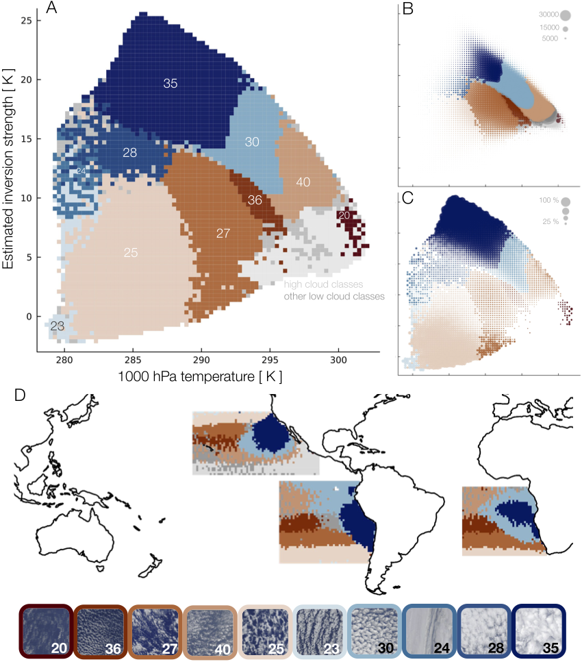
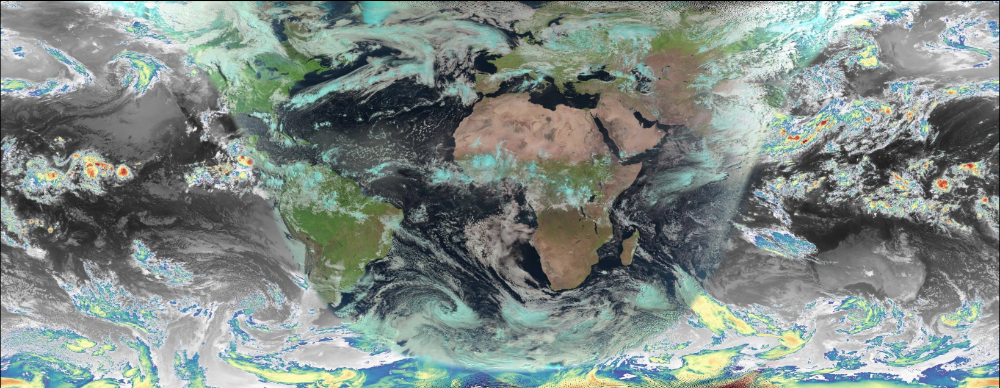
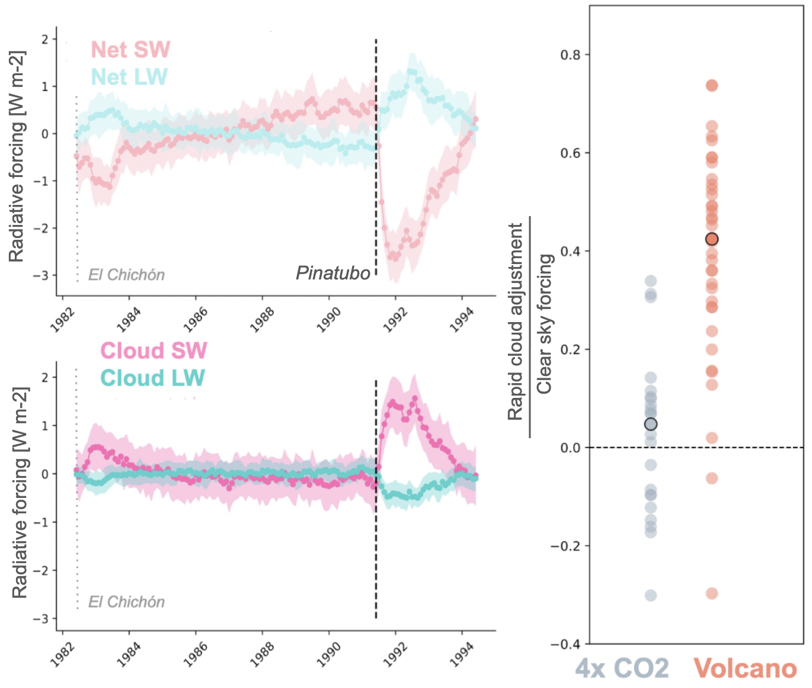
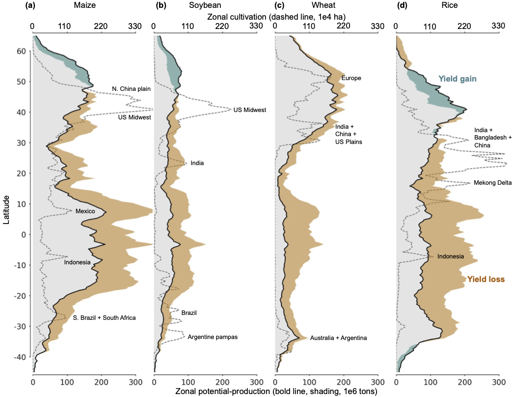
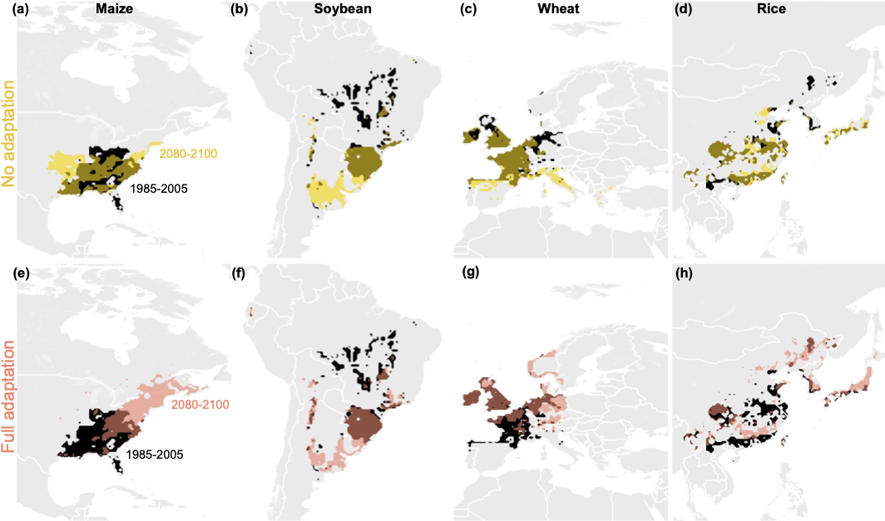

# Clouds 
Clouds represent the biggest source of uncertainty in climate response to CO$_2$ forcing. Of special concern are the stratocumulus decks found in the subtropics. Modeling their dynamics is challenging at scale, and so their behavior must be approximated in global models. Satellite observations provide an opportunity to learn about cloud physics, but represent a serious data challenge. 

## Temperature controls on low cloud morphology 
Using a self-supervised cloud classification system based on an auto-encoder applied to MODIS multi-spectral imagry, we can identify cloud types based on texture, which may diferentiate physical processes. When employed on 20 years of MODIS observations and co-located we reanalysis weather data. We find that low cloud texture in the subtropics is well-explained by the temperature structure of the lower tropopshere, specifically the estimated inversion strenght and the near surface temperature. In each temperature regime, you are most likely to find a certain class of clouds (boundaries are less clear).

**[above]** A) AICCA cloud classes mapped to a meteorological domain of near-surface temperature and inversion strength, for all patches in the three main subtropical stratocumulus regions.  Regions of dominance are generally well-separated and coherent. The 10 most dominant classes are color-coded; all high clouds (mean cloud top pressure $>$680 hPa) are shown in light grey.  Nine of the 10 classes are stratocumulus; #20 is thinner and higher. Thumbnail images of typical class members are shown at bottom. (B) As in panel A but with dots scaled in size according to frequency of those meteorological conditions (for samples with clouds). The trade winds tend to move parcels on this diagram from upper left to lower right, i.e.\ from cold and stable to warmer and less stable, with clouds textures responding by becoming more open: #35 -> \#30 -> \#40.  (C) As in panel A but with dots scaled to represent the share of all clouds by the most dominant cloud class. Very high- or low-stability conditions produce more consistent textures. (D) The three stratocumulus regions color-coded by the most dominant cloud class in each location, using the same color code. Classes are distributed in understandable geographic patterns, following large-scale environmental gradients. As expected, zones of thick stratocumulus are in the subtropics.

See more details: https://github.com/jamesafranke/AICCA/blob/master/ms/low_marine_clouds_met_PNAS.pdf

## Data-driven cloud forecasting
Recent advances deep learning architctures have motivage a resurgence in in data-driven weather forecasting. However, all recent transformer-based forecast models are trained on reanalysis model data (usually ERA5, which does not contain all the revelant cloud phyisics to begin with. We developed a new machine-learning ready cloud dataset based on the 5 main geostationary satelites we call CloudBench (following WeatherBench) in order to facilitate data-driven cloud forecasting. 

**[above]** CloudBench RGB mosaic constructed from 5 geostationary satellites with ``natural" color on the day side (high clouds in blue) and colorized IR clouds on the night side.

Using these observations, we employ a decoder-only transformer (GPT-like) to learn the relationship between two historical timesteps and one future timestep. Forecasts can in principle be rolled out indefinitely. Research is preliminary. 

**[above]** 6-hour forecast rolled out at 30 min timestep for the Western Pacific. 

# Climate Interventions
Stratospheric aerosol injection may impact low clouds by changing the radiative cloud top cooling or vertical temperature structure of the atmosphere. I am investigating this potential through a combination of large eddy simulations and satelite observations. Prelimary analysis in global scale models shows that low clouds repond relativly more to SAI forcing than to CO2.  

[above] SAI may disrupt clouds more than CO$_2$. Left time series: net and cloud-only forcing following simulated volcanic eruptions for EC-Earth climate model. Right scatter: global mean rapid cloud adjustment to abrupt CO$_2$ forcing and volcanic SAI (averaged from 4 simulated historic eruptions) for the first three years post CO$_2$ forcing or eruption (the ratio of the integrals between the pink-blue line of the top and bottom time series plots). A value of 0.5 indicated the cloud radiative effect dampens the SAI forcing by half. (The CO$_2$ effect is opposite.) Dots represent individual CMIP-6 models averaged over all available realizations. Analysis not yet published.

# Food Security

## Heat stress for cattle
Cattle farming is a major source of global food production and livelihoods that is being impacted by climate change. However, despite numerous studies reporting local-scale heat impacts, quantifying the global risk of heat stress to cattle from climate change remains challenging. We conducted a global synthesis of documented heat stress for cattle using 164 records to identify temperature-humidity conditions associated with decreased production and increased mortality, then projected how future greenhouse gas emissions and land-use decisions will limit or exacerbate heat stress, and mapped this globally. The median threshold for the onset of negative impacts on cattle was a temperature-humidity index of 68.8 (95% C.I.: 67.3–70.7). Currently, almost 80% of cattle globally are exposed to conditions exceeding this threshold for at least 30 days a year. For global warming above 4°C, heat stress of over 180 days per year emerges in temperate regions, and year-round heat stress expands across all tropical regions by 2100. Limiting global warming to 2°C, limits expansion of 180 days of heat stress to sub-tropical regions. In all scenarios, severity of heat stress increases most in tropical regions, reducing global milk yields. Future land-use decisions are an important driver of risk. Under a low environmental protection scenario (SSP3-RCP7.0), the greatest expansion of cattle farming is projected for tropical regions (especially Amazon, Congo Basin, and India), where heat stress is projected to increase the most. This would expose over 500 million more cattle in these regions to severe heat risk by 2090 compared to 2010. A less resource-intensive and higher environmental protection scenario (SSP1-RCP2.6) reduces heat risk for cattle by at least 50% in Asia, 63% in South America, and 84% in Africa. These results highlight how societal choices that expand cattle production in tropical forest regions are unsustainable, both worsening climate change and exposing hundreds of millions more cattle to large increases in severe, year-round heat stress.

[above] Cattle husbandry is projected to expand most in heat-stressed countries. (a) Historical heat exposure for cattle showing where historical yearly heat stress severity intersects with historical cattle densities from FAO [58]. (b) Projected country-level change in cattle numbers and heat hazard (that is severity of heat stress) in cattle farming regions for a high-emissions, low environmental protection 'Regional Rivalry' scenario (SSP3-RCP7.0) in 2085–2095 compared to a 1985–2014 baseline. Bubble size is the projected number of cattle in each country in 2090. Countries with more than 30 million cattle in 2090 are labelled with their ISO codes. See figure S13 for projected exposure and heat hazard changes from 2030 through to 2090, and figure S14 for a comparison between 3b and the same data under SSP1-RCP2.6.

See more details: https://iopscience.iop.org/article/10.1088/1748-9326/aceb79

## Shifting cropland under climate change
Modern food production is spatially concentrated in global “breadbaskets.” A major unresolved question is whether these peak production regions will shift poleward as the climate warms, allowing some recovery of potential climate-related losses. While agricultural impacts studies to date have focused on currently cultivated land, the Global Gridded Crop Model Intercomparison Project (GGCMI) Phase 2 experiment allows us to assess changes in both yields and the location of peak productivity regions under warming. We examine crop responses under projected end of century warming using seven process-based models simulating five major crops (maize, rice, soybeans, and spring and winter wheat) with a variety of adaptation strategies. We find that in no-adaptation cases, when planting date and cultivar choices are held fixed, regions of peak production remain stationary and yield losses can be severe, since growing seasons contract strongly with warming. When adaptations in management practices are allowed (cultivars that retain growing season length under warming and modified planting dates), peak productivity zones shift poleward and yield losses are largely recovered. While most growing-zone shifts are ultimately limited by geography, breadbaskets studied here move poleward over 600 km on average by end of the century under RCP 8.5. These results suggest that agricultural impacts assessments can be strongly biased if restricted in spatial area or in the scope of adaptive behavior considered. Accurate evaluation of food security under climate change requires global modeling and careful treatment of adaptation strategies.

[above] 

[above]

See more details: https://onlinelibrary.wiley.com/doi/abs/10.1111/gcb.15868

