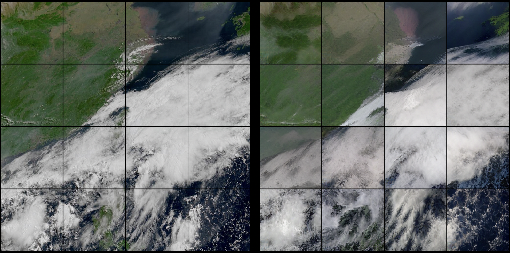

# Clouds 
Clouds represent the biggest source of uncertainty in climate response to CO$_2$ forcing. Of special concern are the stratocumulus decks found in the subtropics. Modeling their dynamics is challenging at scale, and so their behavior must be approximated in global models. Satellite observations provide an opportunity to learn about cloud physics, but represent a serious data challenge. 

## Temperature controls on low cloud morphology 
Using a self-supervised cloud classification system based on an auto-encoder, we can track cloud population dynamics. 

## Data-driven forecasting
Motivated by recent advances in data-driven weather forecasting

We employ a decoder-only transformer (GPT-like) to learn the relationship between two historical timesteps and one future timestep. Forecasts can in principle be rolled out indefinitely. Research is preliminary. 

[above] 6-hour forecast rolled out at 30 min timestep for the Western Pacific. 

# Climate Interventions
Stratospheric aerosol injection may impact low clouds by changing the radiative cloud top cooling or vertical temperature structure of the atmosphere. 

# Food Security

## Heat stress for cattle
Cattle are by far the most economically important livestock species worldwide, with estimated over 1 billion animals. 

We employ a meta-analyis of published cattle heat stress studies. 

Crucially, land use forecasts of increased agricutual land are most dramatic in tropical rainforests. This drives a 

## Shifting cropland under climate change

Without extensive growing season adaptations (and associated cultivar development), regions of peak yield do not shift 

